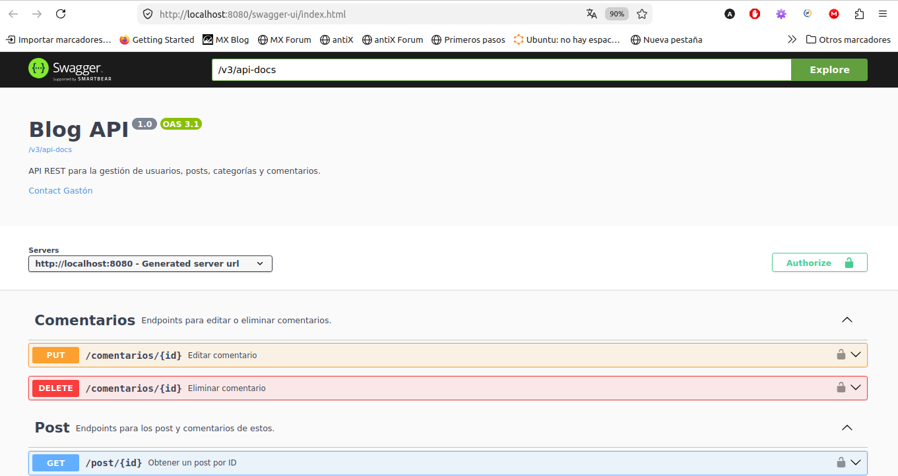
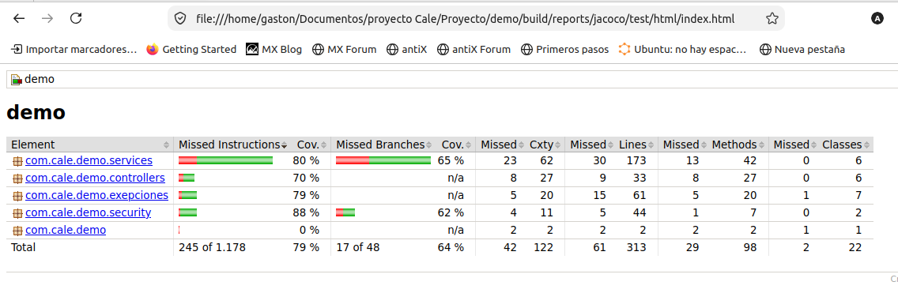

# Blog API


API REST desarrollada con Spring Boot para la gestión de usuarios, publicaciones, categorías y comentarios.
El proyecto implementa autenticación mediante JWT, autorización basada en roles (USER y ADMIN), validaciones, documentación con Swagger/OpenAPI y pruebas unitarias e integración.

## Características

- API REST siguiendo una arquitectura en capas.
- Autenticación mediante JWT.
- Autorización basada en roles.
- Validación de datos con Jakarta Validation.
- Manejo global de excepciones.
- Documentación automática con Swagger/OpenAPI.
- Persistencia con Spring Data JPA.
- Tests unitarios con Mockito y MockMvc.
- Tests de integración con H2.
## Tecnologías utilizadas

- Java 21
- Spring Boot 3
- Spring Security
- JWT
- Spring Data JPA
- Hibernate
- MySQL
- H2 Database (tests)
- JUnit 5
- Mockito
- MockMvc
- Swagger / OpenAPI
- Gradle
- JaCoCo

## Funcionalidades
### Usuarios
- Registro de usuarios
- Inicio de sesión
- Contraseñas cifradas con BCrypt
- Autenticación mediante JWT
### Posts
- Crear posts
- Editar posts
- Eliminar posts
- Obtener posts paginados
- Buscar por filtros
### Comentarios
- Agregar comentarios
- Listar comentarios
- Eliminar comentarios
### Categorías
- Crear categorías
- Obtener categorías
- Editar categorías
- Eliminar categorías
### Seguridad
- Roles USER y ADMIN
- Solo el autor puede modificar sus publicaciones
- El administrador puede modificar cualquier publicación
- Protección mediante JWT
- Validación de permisos

## Arquitectura

```text
                  HTTP Request
                       │
                       ▼
                Spring Controller
                       │
                       ▼
                 Service Layer
                       │
                       ▼
              Spring Data JPA
                       │
                       ▼
                    MySQL
```

## Diagrama

```text
Usuario (1)
│
├─────────────┐
│             │
▼             ▼
Post (N)   Comentario (N)
│
│ N
▼
Categoria (N)
```

## Modelo de datos

Usuario
   - id
   - nombre
   - email
   - password
   - rol

Post
   - titulo
   - descripcion
   - usuario
   - categorias

Categoria
   - nombre

Comentario
   - comentario
   - usuario
   - post

## Seguridad

Todas las solicitudes protegidas deben incluir el siguiente encabezado:

```http
Authorization: Bearer <JWT>
```

## Documentación

Swagger disponible en
http://localhost:8080/swagger-ui/index.html
## Swagger


## Cómo ejecutar el proyecto
### Clonar
```bash
git clone https://github.com/Gaston11/blog-api.git
``` 

### Configurar MySQL
#### Editar
```bash
application.properties 
```
#### Con
```properties
spring.datasource.url=...
spring.datasource.username=...
spring.datasource.password=...
```

### Ejecutar
```bash
./gradlew bootRun
```

### Ejecutar tests
```bash
./gradlew test
```

## Cobertura de pruebas

### Actualmente el proyecto incluye:

- Tests unitarios
- Tests de integración con H2
- MockMvc
- Mockito

### Se validan:

- Registro
- Login
- JWT
- CRUD de Posts
- CRUD de Categorías
- Comentarios
- Roles
- Permisos
- Validaciones

#### El proyecto utiliza **JaCoCo** para medir la cobertura de los tests unitarios y de integración.


####La cobertura actual es aproximadamente:

| Métrica | Cobertura |
|---------|----------:|
| Instrucciones | **79%** |
| Branches | **64%** |
| Líneas | **80%** |

El reporte HTML se genera con:

```bash
./gradlew jacocoTestReport
```

y puede consultarse en:

```
build/reports/jacoco/test/html/index.html
```

### Endpoints principales

| Método | Endpoint               | Descripción        |
| ------ | ---------------------- | ------------------ |
| POST   | /auth/register         | Registrar usuario  |
| POST   | /auth/login            | Iniciar sesión     |
| GET    | /post                  | Obtener posts      |
| POST   | /post                  | Crear post         |
| PUT    | /post/{id}             | Modificar post     |
| DELETE | /post/{id}             | Eliminar post      |
| POST   | /post/{id}/comentarios | Agregar comentario |
| GET    | /categorias            | Listar categorías  |

### Ejemplo real
### POST /auth/register

```
Request

{
  "nombre":"Gaston",
  "apellido":"Perez",
  "email":"gaston@mail.com",
  "password":"123456",
  "prioridad":1
}

Response

201 Created
```


### Ejemplo de flujo
Registrar usuario
```POST /auth/register```

↓

Login
```POST /auth/login```

↓

Obtener JWT

↓

Consumir la API
```Authorization: Bearer <token>```

### Funcionalidades implementadas
✅ JWT
✅ BCrypt
✅ Roles
✅ Swagger
✅ Validaciones
✅ Manejo global de excepciones
✅ Tests unitarios
✅ Tests de integración
✅ JaCoCo (Cobertura de pruebas) 
✅ Paginación
✅ Comentarios
✅ Categorías

### Próximas mejoras
- Docker
- GitHub Actions (CI)
- JaCoCo (cobertura)
- Logging con SLF4J
- Cache con Spring Cache
- Auditoría de usuarios
- Despliegue en la nube
## Authors

- [@Gaston11](https://github.com/Gaston11)
